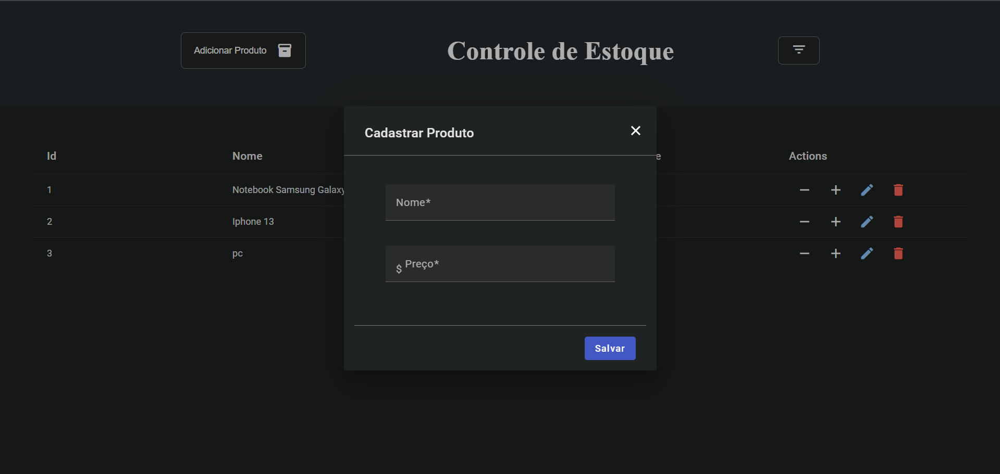

# Stock Control

Project with Mysql for controlling stock of products.

## Application design

### Technologies

- 
- 
- 
- 

- ## How to run local

1. clone o repositorio e baixe todos os pacotes usando npm install, depois rode no terminal:
> `npm run start`
2. crie o database stockcontroldb em seu banco mysql:
3. Run the server:

Finish! Now the application are running in your machine!
